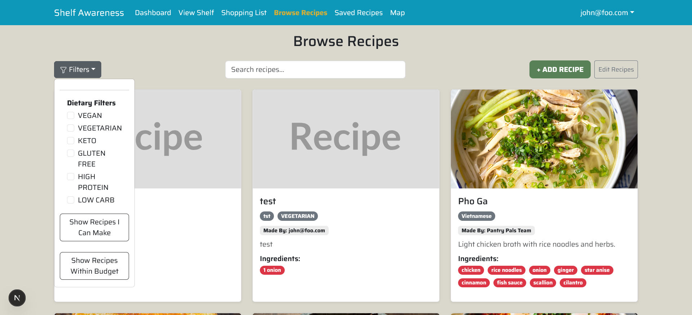
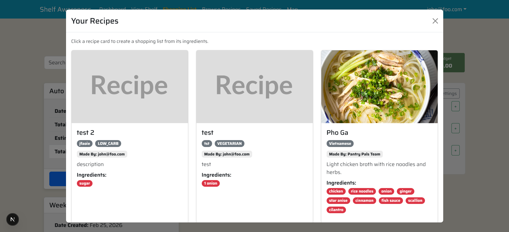

## The Brief
This is my reflection on ICS 414: Software Engineering II.
We were tasked with working on a project for the duration of our semester. For us, this meant building off an existing project from previous students and rewriting it with our desired functional changes. Most of our time was spent deciphering the code from the existing project and figuring out how to implement new functions or modify those that were already implemented. Communication with my team was held over Discord, where we kept each other up-to-date on our CI/CD Github pipeline. Conflicts in Github were very rare, and things went pretty smoothly overall.

## My Contributions
I was responsible for several of the technical sides of our Shelf Awareness website's UI. My goal was to make using the website a more intuitive and receptive experience for the average user. What I first did was update a few pages on the website so that if the user would create or modify an entry on said page, it would update upon submission and be reflected on-screen immediately in real time than require a page refresh. I also added filters to the search functions of some pages, and made user data from certain pages accessible in other pages so that I could add more functions which were capable of referencing the user's data and using it to modify some other data belonging to the user, within the same page.

## My Favorite Implementations: Intuitive Functionality
I mentioned sorting and filtering being one of the functionalities that I worked on, and for those all I really did was look for what would be the most useful filters people would likely use, like recipes they can afford to make or recipes they have the ingredients to make. I could've added more filters, but I felt like adding any more would complicate things. I wanted the website to be on the simpler side, where all it takes is one glance to get an understanding of how everything works. That meant choosing words and phrases that conveyed the purpose of those functions quickly. The last thing I'd want is for someone to go into the website, try to use some function, get a result that they didn't expect, and think to themselves that either something is wrong with the website, or something is wrong with them! Minimizing these grievances is the psychological key to making websites like these fun to use: they're intuitive.

  
  

Those functions that cross-referenced user data across different pages also required that the user would know exactly what data was being referenced and what for. In the Shopping List page is a "Create From Recipe" button that generates a Shopping List using the ingredients present in a Recipe from the user's "Recipes" List. These Recipes can all be found in the Browse Recipes page which showcases each Recipe with an image that the user selects to represent the recipe. So, I thought these images would be integral to quickly realizing that the "Create From Recipe" function was selecting from the user's own list of Recipes, and I ended up implementing a modal window which could show just that (alongside the user's entire Recipe collection).

## Programming Insights from this Course
We were allowed to use any legitimate resource that offered us guidance on how to code. This meant anything from official documentation, wikipedia pages, youtube videos, and some AI. I used a little bit of everything. I hadn't used HTML, CSS, and JavaScript for a year prior to this course, so I had some catching up to do. Luckily, because the codebase we were building on was written by students with about the same technical skills as us, their code eventually became easy to understand as a student myself. After getting re-acquainted with the stack, it became more and more clear that the shortcuts or ad-hoc solutions the previous team was relying on weren't far from the solutions I would've gone for.

## Conclusion
This was a good course. It forced me to work with people and communicate with them. It forced me to read other people's code and understand where it came from. It forced me to learn the language of the code itself so that I could write it and improve it wherever it needed improvements. The pace of this course was reasonable, and having milestones allowed our team to pace ourselves around the milestones and get even more coordinated. It was a great way to simulate a professional workflow without having to put my life on the line. Thank you!
